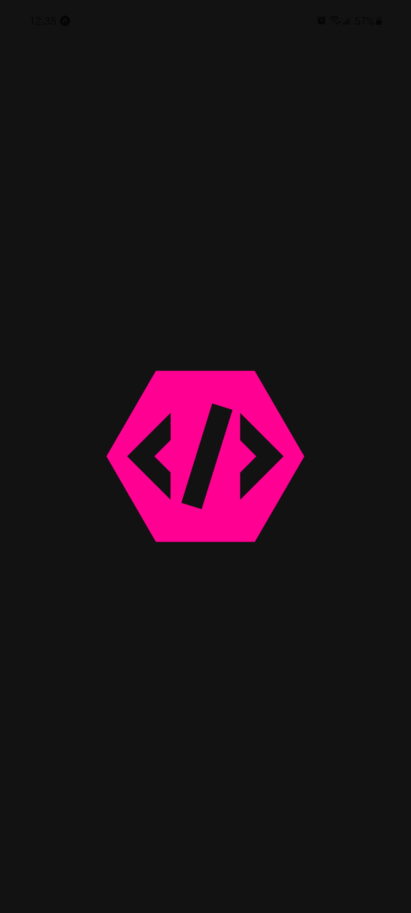
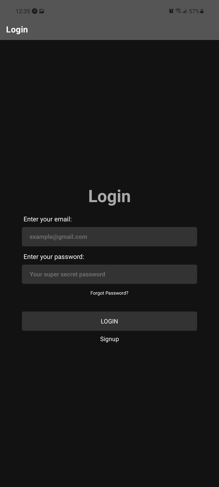
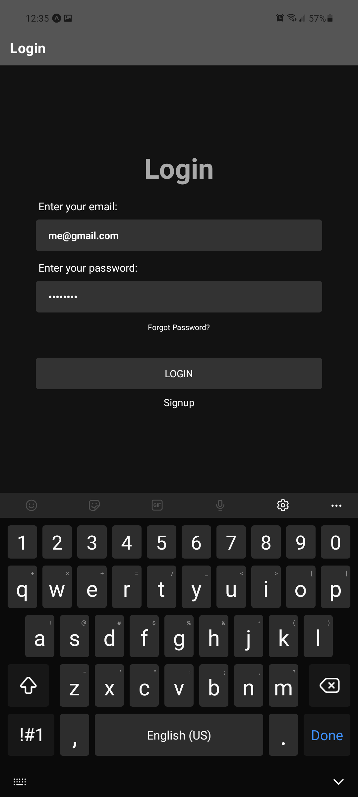
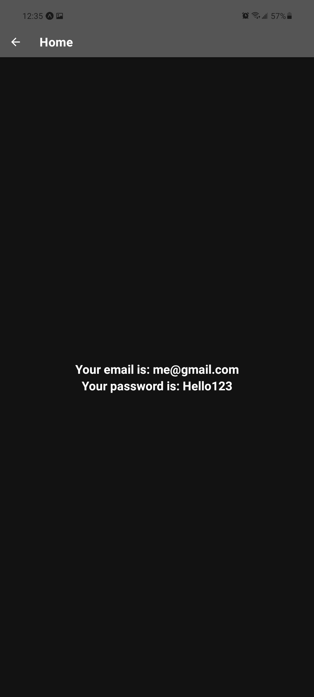

### Playground

#### About
This is a site built in [react-native](https://reactnative.dev/). It contains a login page and a homepage.

The login page does not currently check for valid email and the password field does not have a minimum requirement since this is just a POC.

#### Installation
To start this project, do the following:

First, clone the project to your local, this step requires you to have [git](https://git-scm.com/) installed.
```
$ git clone https://github.com/DPulavarthy/Playground
```

Then, install the dependencies and the [expo-cli](https://expo.dev/) with the following commands:
```
$ npm install
$ npm run build
```

Finally, start the project by running:
```
$ npm start
```

#### Screenshots
Splash screen (Icon copyright of [Discord](https://discord.com/))


Login Page


Login Page (Fulfilled)


Homepage
